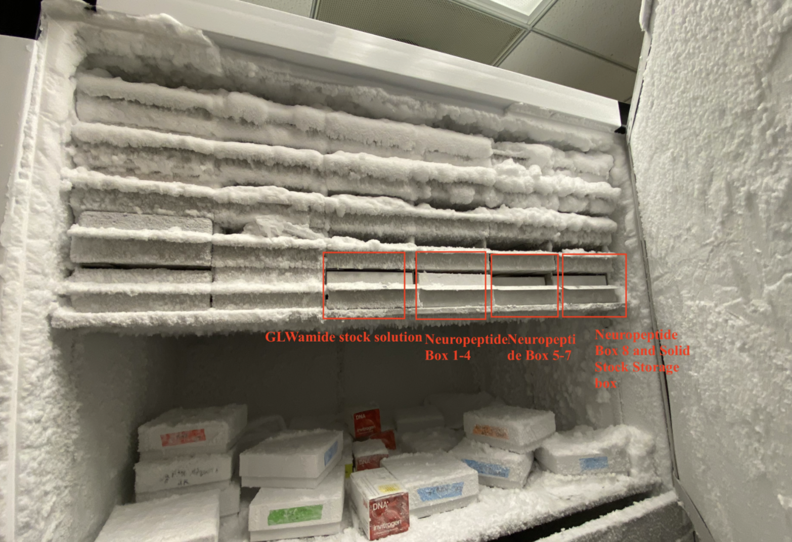

# Inventory

[Open Full Inventory Google Sheet](https://docs.google.com/spreadsheets/d/1iXNCr99zkwkLIDlmf_3LmtFIzElFjvH_sGyCheEH_Ps/edit?gid=1032716157#gid=1032716157)

<iframe src="https://docs.google.com/spreadsheets/d/1iXNCr99zkwkLIDlmf_3LmtFIzElFjvH_sGyCheEH_Ps/edit?gid=1032716157#gid=1032716157&amp;headers=false" width="100%" height="500"></iframe>

## Plasmids

This is the working (6/1/2025) plasmid list, we're hoping to update it with more information (see above). [Open the Weissbourd Lab Plasmid List (Google Sheet)](https://docs.google.com/spreadsheets/d/1GUTBL81ej8NBAD7cExpj-rX17h-S1-kIB7H--sqDXmQ/edit?gid=0#gid=0)

## Neuropeptides

